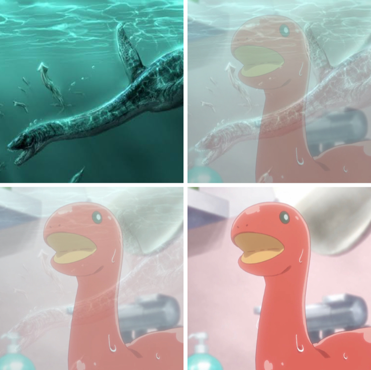

# Fading meme generator

This simple iOS application can be used to create memes with one image fading into a second image. It also allows to share between iOS apps or saving to the camera roll using a `UIActivityViewController`.

## Example image

## Usage

1. Tap on the `First Image` and `Second Image` to add images.
2. You can swap between the images using the `Swap` button.
3. Share using the system action button.